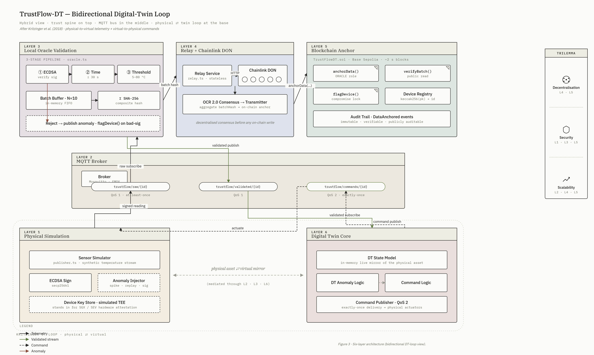

# TrustFlow-DT

**Evaluating Oracle-Based Data Validation for Simulated Digital Twin Environments: A Proof-of-Concept Implementation**

> Final Year Project — BSc (Hons) Computer Science  
> Staffordshire University
> Author: Chidube Steve Anike  

---

## What This Project Is

Digital twin systems depend on a continuous stream of sensor data to maintain an accurate virtual mirror of a physical asset. When that data pipeline is integrated with a blockchain for immutability, a structural problem emerges: the blockchain can guarantee that data has not been altered *after* it is written on-chain, but it cannot verify that the data was trustworthy *before* it was submitted. Suhail et al. (2022) quantify this gap — 23% of blockchain-integrated IoT systems lack pre-ingestion validation, and 15% have no mechanism for detecting tampered sensor data at all.

TrustFlow-DT is a proof-of-concept system that addresses this gap through **oracle-mediated pre-ingestion validation**. Every sensor reading is cryptographically signed at the device, validated by a local oracle before it updates the digital twin, and batch-anchored on-chain via Chainlink Functions for decentralised consensus. The result is a two-tier hybrid architecture that satisfies both the sub-3-second latency requirement of a live digital twin and the integrity guarantees of a public blockchain.

---

## Architecture

The system is structured across six layers. Data flows upward from the simulated physical device through validation to the blockchain anchor, and commands flow back down to close the bidirectional digital twin loop.



| Layer | Component | File | Status |
|---|---|---|---|
| L1 Physical Simulation | Sensor simulator + ECDSA signing | `src/simulation/dataGenerator.ts` | ✅ Complete |
| L1 Physical Simulation | MQTT publisher | `src/mqtt/publisher.ts` | ✅ Complete |
| L2 MQTT Broker | Mosquitto (local) / EMQX (demo) | External | ✅ Running |
| L3 Local Oracle Validation | 3-stage validation pipeline | `src/validation/oracle.ts` | 🔧 In progress |
| L3 Local Oracle Validation | Anomaly injector | `src/simulation/anomalyInjector.ts` | 🔧 In progress |
| L4 Relay + Chainlink DON | HTTP relay service | `src/relay/relay.ts` | 📋 Planned |
| L5 Blockchain Anchor | Smart contract | `src/blockchain/contracts/TrustFlowDT.sol` | ✅ Complete |
| L5 Blockchain Anchor | Chainlink Functions consumer | `src/blockchain/contracts/TrustFlowFunctionsConsumer.sol` | 📋 Planned |
| L6 Digital Twin Core | In-memory state model | `src/digitalTwin/dtCore.ts` | 📋 Planned |

**MQTT topic namespace:**

| Topic | Direction | QoS | Purpose |
|---|---|---|---|
| `trustflow/raw/{deviceId}` | Device → Oracle | 1 | Signed telemetry readings |
| `trustflow/validated/{deviceId}` | Oracle → DT Core | 1 | Oracle-approved readings |
| `trustflow/anomaly/{deviceId}` | Oracle → Monitoring | 1 | Rejected readings with reason |
| `trustflow/commands/{deviceId}` | DT Core → Device | 2 | Actuation commands |

---

## Tech Stack

| Concern | Technology |
|---|---|
| Language | TypeScript (Node.js) |
| MQTT broker | Mosquitto (local dev) / EMQX (demo) |
| MQTT client | mqtt.js v5 |
| Cryptography | Node.js built-in `crypto` (ECDSA secp256k1) |
| Canonical serialisation | `canonical-json` |
| Smart contracts | Solidity 0.8.19, Hardhat |
| Decentralised oracle | Chainlink Functions |
| Blockchain / testnet | Base Sepolia (L2) |
| Runtime | tsx (TypeScript runner) |

---

## Prerequisites

- [Node.js](https://nodejs.org/) v18 or later
- [Mosquitto MQTT broker](https://mosquitto.org/download/) — add to PATH after installation
- npm (comes with Node.js)

---

## Getting Started

### 1. Clone and install

```bash
git clone https://github.com/YOUR_USERNAME/trustflow-dt.git
cd trustflow-dt
npm install
```

### 2. Configure environment

Copy the example environment file and adjust if needed:

```bash
cp .env.example .env
```

The defaults work out of the box for local development. The only values you may want to change:

```dotenv
TRUSTFLOW_BROKER_URL=mqtt://localhost:1883
TRUSTFLOW_DEVICE_ID=device-001
TRUSTFLOW_INTERVAL_MS=1000
TRUSTFLOW_DURATION_MS=0
```

> **Note:** Leave `TRUSTFLOW_KEY_PATH` unset or remove it entirely. Setting it to an empty string will cause an error. If unset, the publisher automatically stores the device keypair at `keys/{deviceId}.json`.

### 3. Start the MQTT broker

Open a terminal and run:

```bash
mosquitto
```

You should see:

```
mosquitto version 2.x.x running
```

### 4. Subscribe to the raw telemetry topic (optional — to watch incoming data)

Open a second terminal:

```bash
mosquitto_sub -h localhost -p 1883 -t "trustflow/raw/#" -v
```

This will print each signed reading as it arrives. Leave it running.

### 5. Run the publisher

Open a third terminal from the project root:

```bash
npx tsx src/mqtt/publisher.ts
```

On first run, the publisher generates a new ECDSA secp256k1 keypair and saves it to `keys/device-001.json`. On subsequent runs, it loads the same keypair so the oracle can verify signatures consistently.

**Expected publisher output:**

```
[publisher] starting with configuration:
{ "brokerUrl": "mqtt://localhost:1883", "deviceId": "device-001", ... }
[publisher] generated new keypair at keys/device-001.json
[mqtt] publisher-device-001 connected to mqtt://localhost:1883
[publisher] #1 trustflow/raw/device-001 value=22.04 celsius ts=1780752340123
[publisher] #2 trustflow/raw/device-001 value=21.87 celsius ts=1780752341126
```

**Expected subscriber output:**

```
trustflow/raw/device-001 {"payload":{"deviceId":"device-001","sensorType":"temperature","value":22.04,...},"signature":"3044..."}
```

Press `Ctrl+C` in the publisher terminal to stop. The shutdown is graceful — it finishes any in-flight publish before disconnecting.

---

## Project Structure

```
trustflow-dt/
├── src/
│   ├── blockchain/
│   │   ├── contracts/
│   │   │   ├── TrustFlowDT.sol              ← RBAC + anchoring + device registry
│   │   │   └── TrustFlowFunctionsConsumer.sol  ← Chainlink Functions consumer (planned)
│   │   └── scripts/
│   │       └── deploy.ts                    ← Hardhat deployment script (planned)
│   ├── config/
│   │   └── mqttClient.ts                    ← Shared MQTT connection factory
│   ├── mqtt/
│   │   ├── publisher.ts                     ← Simulated device entry point
│   │   └── subscriber.ts                    ← Generic subscriber helper (planned)
│   ├── simulation/
│   │   ├── dataGenerator.ts                 ← Sensor simulation + ECDSA signing
│   │   └── anomalyInjector.ts               ← Controlled anomaly injection (planned)
│   ├── validation/
│   │   └── oracle.ts                        ← 3-stage validation pipeline (planned)
│   ├── relay/
│   │   └── relay.ts                         ← HTTP bridge to Chainlink DON (planned)
│   ├── digitalTwin/
│   │   └── dtCore.ts                        ← In-memory DT state model (planned)
│   └── types/
│       └── canonical-json.d.ts              ← Type declaration shim for canonical-json
├── docs/
│   └── architecture.png                     ← Six-layer bidirectional architecture diagram
├── keys/                                    ← Device keypairs — gitignored, never commit
├── .env.example
├── .gitignore
├── hardhat.config.ts
├── package.json
└── tsconfig.json
```

---

## Evaluation Targets

The following success criteria drive the evaluation chapter of the final report:

| Criterion | Target | Measurement |
|---|---|---|
| Anomaly detection accuracy | ≥ 85% | 100 controlled injections (spike / replay / invalid signature) |
| Transaction reduction | ≥ 60% | Per-reading baseline vs batch-anchored (N=10) |
| End-to-end latency | < 3 seconds | Timestamp at publish, oracle receive, oracle decide, on-chain confirm — report p95 |
| Data integrity | 100% verifiable | Every anchored batch hash must verify via `verifyBatchHash()` |
| Functional prototype | Live dashboard | Telemetry feed, validation status, transaction hash links |
| L2 deployment | Successful | Contract deployed and tested on Base Sepolia |

---

## Security Notes

- The `keys/` directory contains ECDSA private key material. It is listed in `.gitignore` and must never be committed to version control.
- This project uses a **software-simulated TEE**. In production, private keys would be generated inside and never leave a hardware secure element (Intel SGX / ARM TrustZone). This limitation is explicitly acknowledged in the research scope.
- The public key for each device would be registered on-chain in the device registry at provisioning time. The private key stays on the device.

---

## References (key sources)

- Suhail, S. et al. (2022) 'Towards Situation-Aware Trusted Digital Twins', *ACM Computing Surveys*
- Kritzinger, W. et al. (2018) 'Digital Twin in manufacturing', *IFAC-PapersOnLine*
- Ferone, D. and Verrilli, F. (2025) 'Blockchain-based Digital Twin', *Future Internet*
- Segovia, M. and Garcia-Alfaro, J. (2022) 'Design, Modeling and Implementation of Digital Twins', *Sensors*
- Mishra, B. and Kertesz, A. (2020) 'The Use of MQTT in M2M and IoT Systems', *IEEE Access*
- Chainlink Foundation (n.d.) *Chainlink Functions Documentation*

---

## Licence

Academic project — all rights reserved. Not licensed for commercial use.