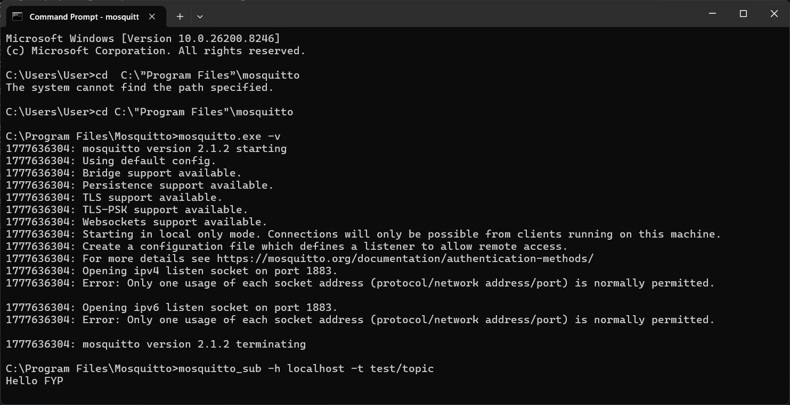

So I'll be beginning my logbook entry. Today is the 23rd of March and I know I did say I would do this earlier, but procrastination. Has been my best friend so far. So yeah. So far I've been able to find out that when using MQTT/MQTT.js, it is possible for a client for a node to be a publisher and subscribers to one topic/it’s own topic
Sources (https://stackoverflow.com/questions/60636606/can-an-mqtt-publisher-also-subscribe-to-the-same-topic-that-it-is-publishing, https://www.emqx.com/en/blog/mqtt-5-introduction-to-publish-subscribe-model, https://iot.stackexchange.com/questions/294/can-an-mqtt-client-subscribe-to-a-topic-created-by-itself, https://www.hivemq.com/blog/mqtt-essentials-part-4-mqtt-publish-subscribe-unsubscribe/)
. It can publish its own topic and also subscribe to it. Which allows for bidirectional communication and um. Prior to the latest version or earlier modern versions, which I think is 5.1 onwards `MQTT 5.0: Introduces the noLocal subscription flag. Setting this to true tells the broker do not send me my own messages. This elegantly solves the feedback problem.`, there was a feedback loop problem whereby a node publisher would also sort. And it will also, you know, respond to his own message. So if if it publishes a message, a message on the topic, it will receive updates from his own sent out message, which could, you know, create a loop whereby it says something. Like and uh, let's say -10 and it listens to his own command and minuses 10, then goes back to check from the publisher that has 10 been minors and he sees that so. Just continues on and on, but have a future has been added whereby you can specify a particular node not to listen to its own messages. Or not to listen to messages sent from itself, but you know. For multiple clients.

